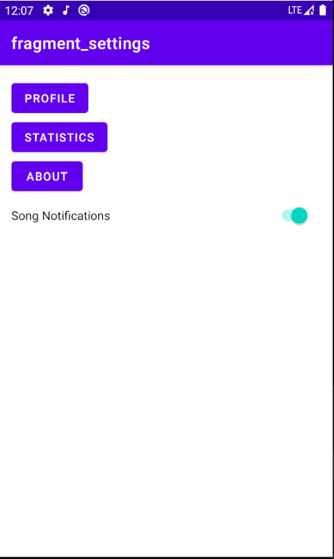
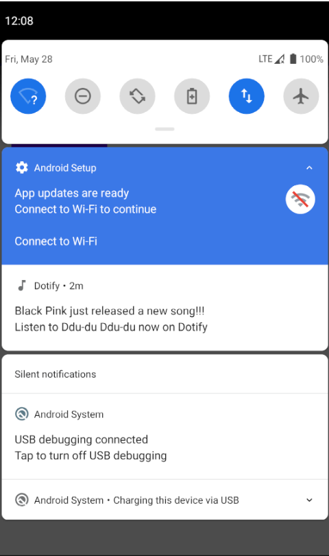

# HW5 - WorkManager & Notifications

## Dotify by Wensi Xu

This is a music player application running on Android. The app shows a list of songs. Users can also see a detailed page of a song which displays the user name, album cover, name of the song playing, the artist name, and the number of plays. They can also see user profile, song statistics, and creator info in setting.

## Extra credit
I have completed extra credit 1&2

## Screenshots

## Installation & Usage
When users click on a song, a mini player on pop up at the bottom, showing the title and artist of the song and a "SHUFFLE" button. The "SHUFFLE" button will shuffle the list of songs.

If users tap on the mini player, the app will navigate to a song detailed page. This page allows users to skip to the previous/next track. Every time a user clicks on the play button, the number of plays will increment by 1.

Users can click on setting to navigate to a setting page, displaying user profile, song statistics, and creator info.

If users is on the profile page, they can swipe down to refresh and load their profile.

Users can turn on song notification in setting. When a new song is released, they will get a notification and can navigate to the new song by clicking on the notification.