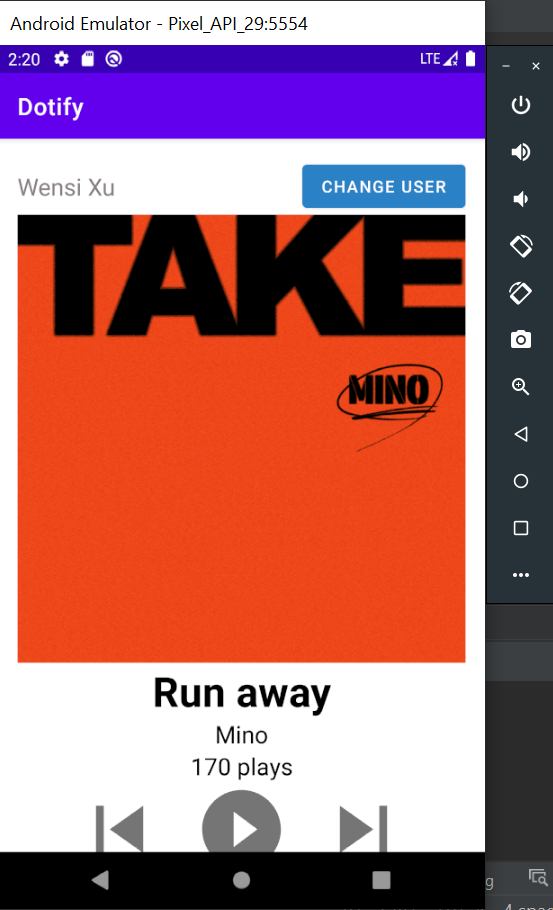

# HW1 - Layouts & Events

## Dotify by Wensi Xu

This is a music player application running on Android. It displays the user name, album cover, name of the song playing, the artist name, and the number of plays. 

## Extra credit
I have completed extra credit #3 and #4

3. If using ConstraintLayout, utilize a Barrier or Guideline somewhere with a view constrained to it (+0.25)

4. All hardcoded dimensions & colors are extracted into res/values/dimens.xml & res/values/colors.xml
   respectively (+ .5)

## Screenshots

## Installation & Usage
username: Wensi Xu

When users click on the "Change Username" button, the app will allow them to change their username and apply the changes. The app also allows users to skip to the previous/next track. Every time a user clicks on the play button, the number of plays will increment by 1.