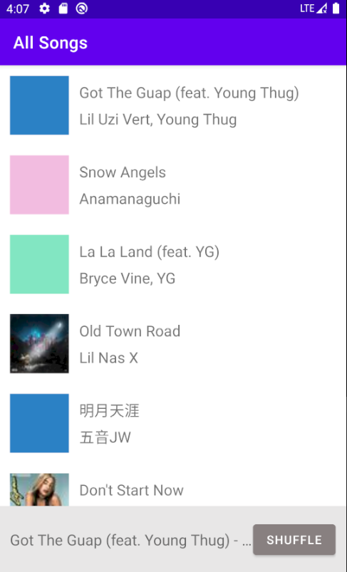
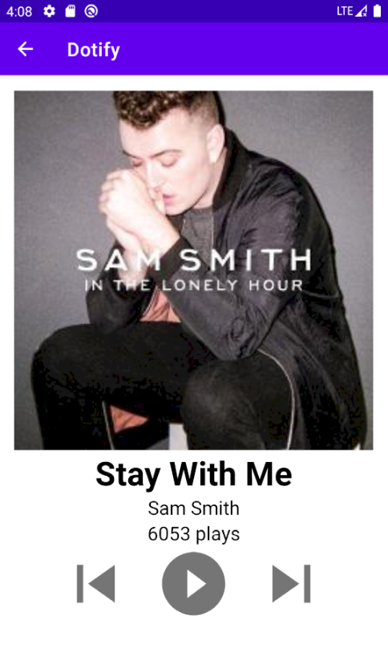

# HW2 - RecyclerView & Multiple Activities

## Dotify by Wensi Xu

This is a music player application running on Android. The app shows a list of songs. Users can also see a detailed page of a song which displays the user name, album cover, name of the song playing, the artist name, and the number of plays. 

## Extra credit
I have completed extra credit #1 and #3

1). Show a stock Android back arrow button, ←, in the Header/Toolbar of Activity B. When clicked, it
should navigate back to SongListActivity (+.25)

3). When a user presses shuffle, the list should animate the changes using DiffUtil (+1)

## Screenshots

## Installation & Usage
When users click on a song, a mini player on pop up at the bottom, showing the title and artist of the song and a "SHUFFLE" button. The "SHUFFLE" button will shuffle the list of songs.

If users tap on the mini player, the app will navigate to a song detailed page. This page allows users to skip to the previous/next track. Every time a user clicks on the play button, the number of plays will increment by 1.